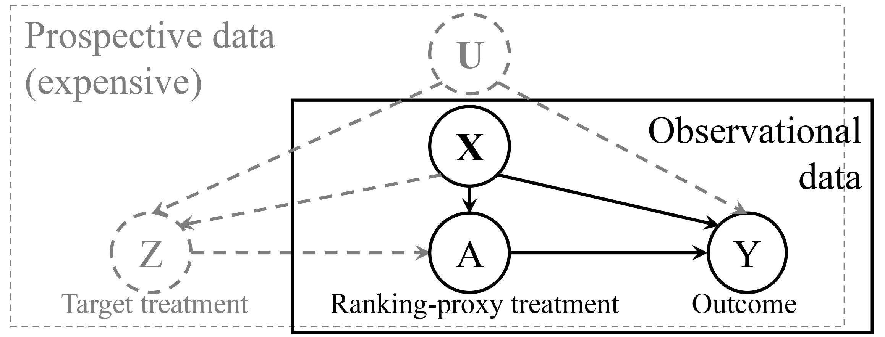

# Split-Treatment Analysis
Code accompanying the paper [Split-Treatment Analysis to Rank Heterogeneous Causal Effects for Prospective Interventions
](https://arxiv.org/abs/2011.05877) published in [WSDM 2021](http://www.wsdm-conference.org/2021/), with the following author list: [Yanbo Xu](https://yanboxu.github.io/), [Divyat Mahajan](https://divyat09.github.io/), [Liz Manrao](), [Amit Sharma](http://www.amitsharma.in/), and [Emre Kiciman](http://kiciman.org/)

# Instructions

Follow the notebook 'simulation.ipynb' to generate results for causal effect estimation and sensitvity analysis using the Split-Treatment framework.

# Brief note about the paper

For many kinds of interventions, such as a new advertisement, marketing intervention, or feature recommendation, it is important to target a specific subset of people for maximizing its benefits at minimum cost or potential harm. However, a key challenge is that no data is available about the effect of such a <em> prospective intervention </em> since it has not been deployed yet. In this work, we propose a <em> split-treatment </em> analysis that ranks the individuals most likely to be positively affected by a prospective intervention using past observational data. Unlike standard causal inference methods, the split-treatment method does  not need any observations of the target treatments themselves. Instead it relies on observations of a  <em> proxy treatment </em> that is caused by the target treatment. Under reasonable assumptions, we show that the ranking of heterogeneous causal effect based on the proxy treatment is the same as the ranking based on the target treatment's effect. In the absence of any interventional data for cross-validation, Split-Treatment uses sensitivity analyses for unobserved confounding to eliminate unreliable models. We apply Split-Treatment to simulated data and a large-scale, real-world targeting task and validate our discovered rankings via a randomized experiment for the latter. 

&nbsp;
&nbsp;
</br>
If you have questions/comments about the code or the paper, please contact [Yanbo Xu](https://yanboxu.github.io/) or [Divyat Mahajan](https://divyat09.github.io)

# If you find this repo useful, please consider citing our paper

```bibtex
@article{xu2020split,
  title={Split-treatment analysis to rank heterogeneous causal effects for prospective interventions},
  author={Xu, Yanbo and Mahajan, Divyat and Manrao, Liz and Sharma, Amit and Kiciman, Emre},
  journal={arXiv preprint arXiv:2011.05877},
  year={2020}
}
```
